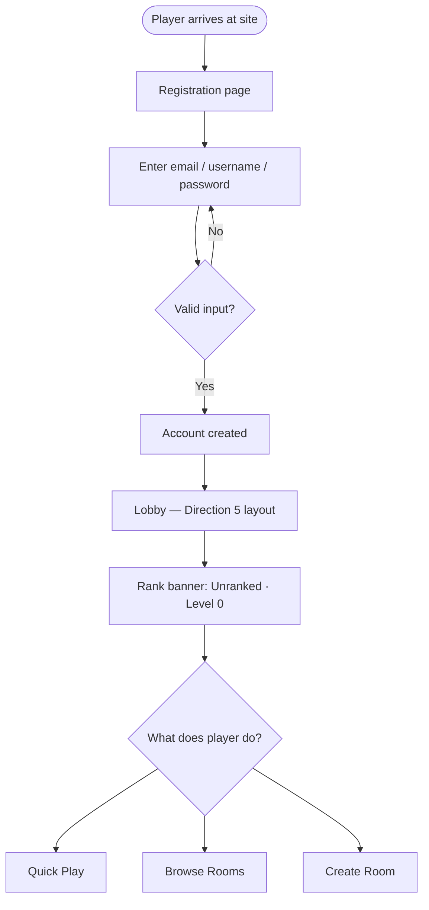
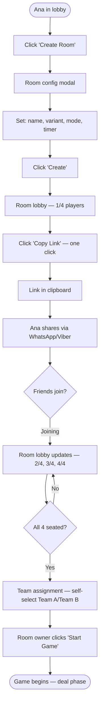
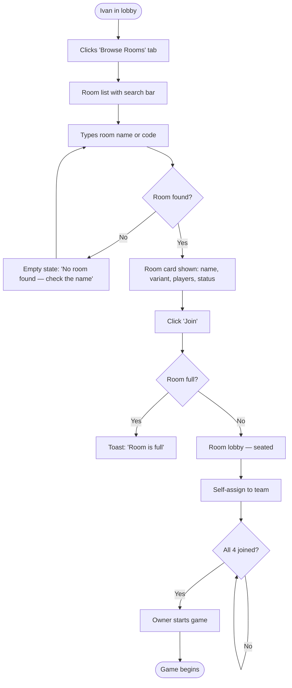
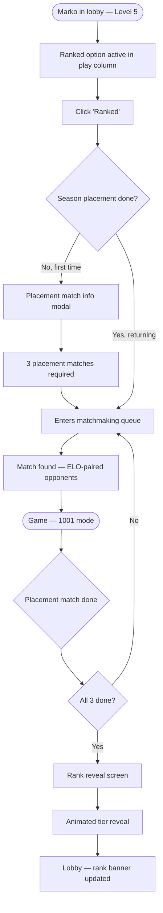
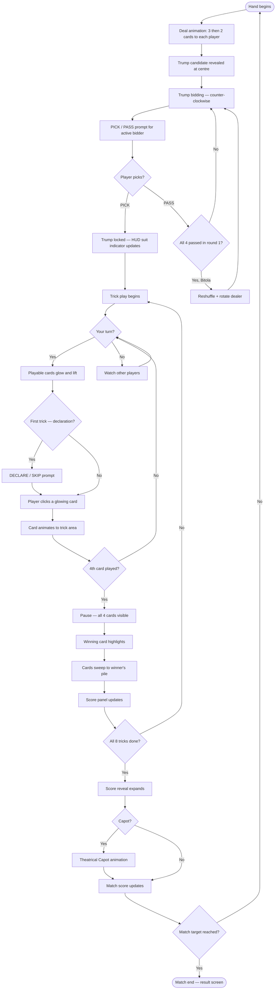

# UX Design Specification beljot

**Author:** Emilijan
**Date:** 2026-03-22

---

## Executive Summary

### Project Vision

Beljot is a purpose-built desktop web multiplayer platform for Balkan Belot — the team-based card game central to the culture of Macedonia, Serbia, and Croatia. No dedicated online platform exists that implements authentic regional rule variants or offers competitive infrastructure. Beljot fills that gap with a modern multiplayer experience: Bitola and Croatian trump variants, casual social play via private rooms, and the first competitive ecosystem for this community — ELO matchmaking, an 8-tier rank system, quarterly seasons, and leaderboards.

The UX vision: a cinematic, Balatro-inspired card game platform that feels built specifically for Balkan Belot players — modern, dramatic, and culturally resonant. A premium experience that makes every existing competitor look dated on first glance.

### Target Users

- **Ana (Casual/Social)** — 40s–60s+, plays with a fixed friend group. Comfortable with online card games. Needs zero-friction private rooms — create, share a code, be playing in under 2 minutes. Success means the Sunday game feels like home.
- **Marko (Competitive Regular)** — Late 20s–30s, sharp and strategic. Wants ELO, rank tiers, a seasonal leaderboard. Needs to know where he stands. Success is a rank next to his name and other serious players to climb against.
- **Ivan (Diaspora)** — 30s–50s, playing cross-border with family. Comfort with online cards, but reliability and ease of room-finding are critical. Success is a Saturday game with cousins that just works.
- **Darko (Room Owner)** — Organizer of the group. Configures the table: variant, mode, timer, reconnect window. Needs control without complexity.

All users are comfortable with online card game conventions — lobbies, matchmaking, turn timers, chat. No hand-holding of basic patterns required.

### Key Design Challenges

1. **4-player turn management** — Communicating active player, counter-clockwise turn order, and per-move timer state instantly and unambiguously across all four seats.
2. **Rules-critical UI moments** — Trump bidding, declaration announcements, Belot bonus triggers — the UI must surface exactly the right prompt at each game-critical moment without breaking immersion or requiring a rules reference lookup.
3. **Lobby serving two audiences** — Ana's zero-friction private room flow and Marko's ranked queue/leaderboard access must coexist cleanly without either cluttering the other.
4. **Disconnection and pause communication** — Reconnect countdowns, stacked pauses, and room owner overrides are anxiety-inducing moments; the UX must communicate state calmly and clearly.
5. **Competitive identity** — Rank tiers, season progress, and placement reveals must feel prestigious and earned.

### Design Opportunities

1. **Balatro-style table aesthetic as differentiator** — Dark, neon-lit, cinematic card table as an instant first-impression win against every dated competitor.
2. **Rank system as visual trophy case** — Glowing tier badges, seasonal leaderboard moments, and rank reveal animations as genuinely exciting competitive theatre.
3. **Lobby as a social café** — Ambient energy (active rooms, live player count, global chat) that makes the lobby feel like a gathering place, not a loading screen.
4. **Scoring and declarations as theatre** — Declaration pop-ups, animated score reveals, and Capot moments as satisfying micro-experiences that reward knowing the game.

## Core User Experience

### Defining Experience

The core action is playing a hand of Belot at a real-time table with three other players. Every other screen — lobby, matchmaking, rankings, profile — exists solely to get players to and from that table. The measure of UX success is how quickly and naturally the table feels like the only place that matters.

### Platform Strategy

- Desktop web SPA, mouse-driven interaction
- No touch support, no mobile layout, no offline functionality for MVP
- Minimum viewport: 1280×720, targeting evergreen browsers (Chrome, Firefox, Edge, Safari)
- Real-time state via persistent WebSocket — the table is always live

### Effortless Interactions

- **Card play:** Single-click plays immediately. No selection + confirm step. Speed matches the competitive pace.
- **Room sharing:** One-click copy-link puts the invite in the clipboard instantly. No copying codes by hand.
- **Declarations:** System auto-detects eligible declarations at the first trick and prompts the player. Players focus on the game, not on memorizing announcement rules.
- **Reconnection:** Automatic reconnection attempt on dropped connection — no user action required.

### Critical Success Moments

- **Ana:** Creates room → copies link → all 4 friends join → game starts. Under 2 minutes, zero confusion. The Sunday game is back.
- **Marko:** Ranked match begins, timer runs, trump candidate appears, PICK / PASS prompt shows clearly — everything feels sharp and competitive from the first hand.
- **Ivan:** Enters room name/code → finds room → joins → game starts with cousins. No technical friction between him and the Saturday game.
- **Everyone:** First hand resolves with correct rules and correct scoring. Trust in the platform is established in the first 5 minutes.

### Experience Principles

1. **The table is the product** — every screen exists to get players to the card table and back. Minimize everything else.
2. **Prompt, don't ask twice** — rules-critical moments (trump bidding, declarations) get one clear contextual prompt. No ambiguity, no re-reads required.
3. **Speed over safety** — single-click play, one-click sharing, no confirmation dialogs. Players who know the game don't need guardrails.
4. **Theatre at the right moments** — score reveals, rank promotions, and Capot moments should feel dramatic. Routine actions should be invisible.

## Desired Emotional Response

### Primary Emotional Goals

- **Social and alive at the table** — players feel genuinely connected to the three others in the room. The game has energy, presence, the feeling of people actually playing together — not four isolated clients sending moves to a server.
- **Slightly dangerous excitement** — the Balatro register: neon-lit, high-stakes atmosphere where something significant always feels about to happen. Not anxiety — anticipation. The table glows. The game matters.
- **Celebratory and theatrical on success** — wins, Capots, rank promotions, and declaration moments get full theatrical treatment. Animations, fanfare, the moment lands. Players should feel the weight of what just happened.

### Emotional Journey Mapping

| Stage                                           | Target Feeling                                                                        |
| ----------------------------------------------- | ------------------------------------------------------------------------------------- |
| First arrival / registration                    | Intrigue — this looks different from anything they've seen for this game              |
| Lobby                                           | Anticipation — the game is close, the room is alive with activity                     |
| Waiting for players to join                     | Low-level excitement — the table is being set                                         |
| Mid-hand, in flow                               | Social and alive — absorbed in the game, aware of the other players                   |
| Rules-critical moment (trump bid, declaration)  | Confident — the prompt is clear, the right action is obvious                          |
| Something goes wrong (disconnect, timer expiry) | Calm and informed — the platform explains what happened and what comes next, no panic |
| Winning a hand                                  | Satisfaction — the score lands with weight                                            |
| Capot / big win moment                          | Theatrical delight — the moment is celebrated, it feels earned                        |
| Ranked promotion / season milestone             | Pride — a rank next to your name that means something                                 |
| Returning to play again                         | Familiarity and belonging — the platform knows you, the game is waiting               |

### Micro-Emotions

- **Confidence over confusion** — every game-critical prompt (PICK / PASS, declaration alert, auto-play notification) must create confidence, not uncertainty
- **Trust over skepticism** — correct rules and correct scoring in the first hand establish trust that carries through the entire session
- **Excitement over anxiety** — the Balatro-style atmosphere creates anticipation, not stress; dramatic tension is in service of the game, not against the player
- **Belonging over isolation** — match chat, team colour identity, and social room dynamics make players feel present with each other, not alone at a screen
- **Pride over neutrality** — rank tiers, season standings, and match history are visual trophies, not dry statistics

### Design Implications

- **Social and alive** → Active player indicators with clear personality; match chat always visible and accessible at the table; team colours (Team A/Team B) as strong identity anchors throughout the game view
- **Balatro excitement register** → Dark background, neon/vivid accent colours, dramatic card reveal animations, glowing rank badges; the visual language should feel like the stakes are real
- **Calm and informative on errors** → Disconnection overlays, timer expiry notifications, and pause states use a composed, legible design — no red alerts, no panic typography; a clear explanation and a clear next step
- **Theatrical on wins** → Score reveal animations, Capot special treatment, rank promotion screens — these are cinematics, not modals; they deserve their own moment
- **Prompt, don't ask twice** → Trump bidding and declaration prompts are visually prominent but contextual — they appear at the right moment, say exactly what's needed, and disappear cleanly

### Emotional Design Principles

1. **Alive, not silent** — the table should always feel occupied; subtle ambient cues (active player highlight, chat presence, timer pulse) keep the room feeling alive even between moves
2. **Drama in service of joy** — the Balatro register is there to elevate the game, not intimidate casual players; the darkness and neon frame celebration, not danger
3. **Calm is a feature** — when things go wrong, the platform's composure is itself reassuring; a calm UI in a frustrating moment builds more trust than any error message ever could
4. **Earn the theatre** — big visual moments (Capot, rank promotion, season end) are theatrical because they're rare and meaningful; routine actions stay invisible so the big moments land harder

## UX Pattern Analysis & Inspiration

### Inspiring Products Analysis

**Balatro** — primary visual and tonal benchmark. Dark background, neon card glows, bold typography, dramatic animations at key moments. Trusts players to orient themselves through clear visual feedback rather than tutorial gates. Every interaction has weight; the table feels theatrical without clutter.

**Facebook Texas Hold 'em Poker** — represents what target players already know. Familiar spatial table layout (seats around a table), active player highlighting, always-visible scores, unambiguous action buttons. Fails on: dated visuals, attention fragmentation from social prompts, ads, and notifications.

**VIP Games / Playok (Belot)** — the incumbent. Players know it exists. Fails on: French-language-first, no competitive features, 2005-era visual design, zero community or progression sense. Every failure is a design opportunity.

### Transferable UX Patterns

**Navigation & Layout:**

- Spatial four-player table layout — universally understood from poker and Facebook card games; adopt directly for Beljot's game view
- Tab-based lobby entry points at equal weight — Quick Play / Browse Rooms / Create Room as peers, no hierarchy

**Interaction Patterns:**

- Persistent visible game context — current score, trick count, and trump suit always on screen; players never hunt for state
- Single dominant action zone — at any moment the one thing the player can do is visually obvious; hand cards are the action zone, everything else recedes
- Explicit action labels — prompts say exactly what they do (PICK / PASS, DECLARE / SKIP), never generic OK/Cancel

**Visual Patterns:**

- Dramatic moment isolation (from Balatro) — score reveals, Capot, rank promotions get their own isolated visual beat; routine UI clears to make space
- Dark background with neon accent system — high contrast, vivid colour for active/interactive elements, receded colour for passive context

### Anti-Patterns to Avoid

- **Social prompt injection** — notifications or engagement nudges during active gameplay; Beljot has no social layer in MVP, nothing interrupts the table
- **Cluttered persistent UI** — information overload at the table; every visible element must be needed for the current hand
- **Ambiguous action labels** — generic "OK / Cancel" on game-critical prompts creates hesitation at the worst moment
- **Static, lifeless table** — a flat table with no ambient energy; Beljot should feel occupied and alive even between turns

### Design Inspiration Strategy

**Adopt directly:**

- Spatial table layout with four named seats (from poker conventions)
- Always-visible game state (score, trick, trump) anchored to the table
- Single-click card play with immediate visual feedback

**Adapt for Beljot:**

- Balatro's dramatic moment treatment → applied to Belot-specific events: Capot, declaration wins, trump selection reveal, end-of-hand scoring
- Facebook poker's active player highlight → adapted for counter-clockwise turn order with clear directional cue

**Reject entirely:**

- Any UI pattern that interrupts active gameplay with non-game information
- Confirmation dialogs on card play
- Passive, static table aesthetics with no ambient energy

## Design System Foundation

### Design System Choice

**Tailwind CSS + shadcn/ui** — a themeable foundation with zero imposed visual identity, built for React.

### Rationale for Selection

- **Visual freedom:** Tailwind applies no default aesthetic — every colour, spacing, and shadow value is defined by the project. The Balatro-inspired dark/neon register is implemented entirely through custom design tokens, with no framework visual opinions to fight.
- **Component ownership:** shadcn/ui components are copied directly into the codebase rather than imported as a package dependency. They are fully owned and customizable — not a black box. Every component can be restyled to the exact Balatro aesthetic.
- **Solo developer efficiency:** Tailwind's utility system eliminates the need to write and maintain custom CSS files for layout, spacing, and states. shadcn/ui provides pre-built accessible component primitives (modals, dropdowns, tooltips) that would otherwise require significant custom implementation time.
- **React-native fit:** shadcn/ui is built specifically for React. No ports or workarounds required.
- **Realistic scope:** The game table itself (card layout, trick area, seat positions) will be fully custom HTML/CSS — no design system covers game UI. Tailwind + shadcn/ui handles everything _around_ the table (lobby, modals, menus, chat, profile, leaderboard) cleanly, so custom engineering effort concentrates where it matters most.

### Implementation Approach

- **Design tokens first:** Define the full Balatro-register token set in Tailwind config before building components — background colours, neon accent palette, typography scale, shadow/glow values, border radii
- **shadcn/ui as the component floor:** Use shadcn/ui primitives for all non-game UI (dialogs, buttons, inputs, tabs, tooltips, dropdowns) and theme them to the token set
- **Custom game components:** Card, Hand, Trick, Seat, ScorePanel, TrumpIndicator, TimerRing — fully bespoke, built on top of the Tailwind token system for visual consistency with the rest of the UI
- **Animation layer:** CSS animations and transitions for card play, score reveal, Capot moments, and rank promotions — defined as Tailwind keyframe extensions

### Customization Strategy

- **Colour system:** One dark base (near-black), one mid-tone surface, neon primary accent (for active player / interactive elements), team colour pair (Team A/Team B), neutral text hierarchy
- **Typography:** Bold, high-contrast — Balatro uses strong typographic presence; headings and score numbers should have visual weight
- **Glow/shadow system:** Neon glow on active cards, highlighted seats, and rank badges — achieved via Tailwind box-shadow tokens, not images
- **Component variants:** Each shadcn/ui component gets a themed variant set — e.g., Button has `primary` (neon accent), `ghost` (receded), `destructive` (for leave/forfeit actions)

## Core Interaction Design

### The Defining Experience

> **"Play a hand of Belot with three real people, in real time, where every card counts."**

Beljot's defining experience is the card hand — from deal to score. Every feature in the product exists to get four players to this moment and make it feel real, sharp, and alive. If the hand feels right, everything else is forgiven. If it doesn't, nothing else matters.

### User Mental Model

Players arrive knowing Belot. They expect:

- A table with four seats, two teams facing each other
- Cards dealt to them, held in hand, played one at a time
- Counter-clockwise turn order — the direction matters and must be visually obvious
- Trump selection as a distinct bidding phase before play begins
- Declarations announced at the first trick, scored once
- A score that accumulates across hands until one team reaches the target

What they do _not_ expect to manage manually:

- Tracking which cards are legally playable (suit-following rules, trump obligations)
- Remembering to declare — the system prompts them
- Calculating scores — the system shows them

The mental model is: _I focus on strategy; the platform handles the bookkeeping._

### Success Criteria

- **Playable cards are immediately obvious** — on your turn, valid cards lift and glow; invalid cards dim. No ambiguity under timer pressure.
- **The turn is never in doubt** — the active player's seat is clearly highlighted; counter-clockwise direction is visually indicated at all times.
- **Trump bidding feels decisive** — the PICK / PASS prompt appears at the right moment, with the trump candidate card prominently displayed. One clear action required.
- **Declarations require zero memory** — at the first trick, if you have a declarable hand, the system prompts you. DECLARE / SKIP. Done.
- **Score lands with weight** — at hand end, the score reveal is deliberate and legible. Players see exactly what happened and why.
- **The hand completes in flow** — no unnecessary interruptions between tricks. Play moves counter-clockwise, feedback is immediate, the next player's state activates cleanly.

### Pattern Analysis

The core card-play interaction uses **established patterns** adapted for Belot's specific rules:

- **Card highlighting for legal moves** — standard in digital card games (Hearthstone, online poker). Adopt directly: playable cards lift + glow neon, unplayable cards dim to ~40% opacity.
- **Spatial seat layout** — four seats around a table, team partners facing each other. Universally understood. Adopt directly.
- **Active player highlight** — a clear visual indicator on the active seat. Adapt: add a directional counter-clockwise cue (subtle arrow or seat transition animation) since Belot's direction is meaningful and non-obvious to new players.
- **Contextual game prompts** — PICK / PASS for trump, DECLARE / SKIP for declarations. Novel in presentation (Belot-specific moments) but familiar in pattern (binary action prompts). No user education required.

### Experience Mechanics

#### Deal Phase

- Cards animate from the centre to each player's hand — 3 cards, then 2 (the Belot dealing sequence)
- Trump candidate card is revealed face-up in the centre after dealing completes
- Trump bidding prompt appears immediately for the first bidder in turn order

#### Trump Selection

- Active bidder sees a prominent PICK / PASS prompt overlaid on the trump candidate card
- PICK → trump is set, suit indicator locks into the permanent HUD, bidding phase ends
- PASS → prompt moves counter-clockwise to the next player
- Bitola variant: if all four pass in round 1, deck reshuffles and dealer rotates — a clear animated transition signals this

#### Card Play — Your Turn

- Your seat activates: seat highlight glows, timer ring begins counting down
- Playable cards in your hand lift slightly and glow (neon accent colour)
- Unplayable cards dim to ~40% opacity
- Single click on a playable card → card animates to the trick area at table centre
- Your seat deactivates; the next counter-clockwise seat activates

#### Declaration Moment (First Trick Only)

- If you hold a declarable combination, a prompt appears before you play: DECLARE / SKIP
- DECLARE → your declaration is announced to all players, logged in the score panel
- Resolution at first trick end: highest declaration wins; only winning team's declarations count — system handles this automatically, result displayed clearly

#### Trick Resolution

- When the 4th card is played, a brief pause (≈1 second) — all four cards visible simultaneously
- Winning card highlights
- Cards sweep to the winning team's trick pile
- Score panel updates with points earned
- Next trick begins — leading player's seat activates

#### Hand End — Score Reveal

- Trick-taking phase ends; a dedicated score reveal moment begins
- Score panel expands: points per team, declarations, last trick bonus, any Capot
- If Capot: full theatrical treatment — animation, distinct visual moment
- Totals update on the match score tracker
- Brief pause, then next hand deal begins automatically

## Visual Design Foundation

### Colour System

**Design philosophy:** Near-black environment with a single high-saturation neon accent — the Balatro register. The darkness makes the game feel serious and cinematic; the neon makes interactive elements unmissable. Team colours (Team A/Team B) are game-defined and non-negotiable; the primary accent (teal-green) is chosen specifically to not conflict with either.

**Palette:**

| Token              | Value       | Usage                                                        |
| ------------------ | ----------- | ------------------------------------------------------------ |
| `background`       | `#0a0a0f`   | Page/app background — near-black with faint blue-purple tint |
| `surface`          | `#13131a`   | Cards, panels, sidebars                                      |
| `surface-elevated` | `#1c1c26`   | Modals, dropdowns, overlays                                  |
| `border`           | `#2a2a38`   | Subtle structural borders                                    |
| `accent`           | `#00e5a0`   | Primary interactive — active cards, buttons, highlights      |
| `accent-glow`      | `#00e5a040` | Neon glow layer (box-shadow/filter)                          |
| `accent-dim`       | `#00804a`   | Pressed/hover state of accent                                |
| `team-a`           | `#ff4d4d`   | Team A identity                                              |
| `team-b`           | `#4d9fff`   | Team B identity                                              |
| `text-primary`     | `#f0f0f8`   | Main readable text — near-white, slight cool tint            |
| `text-secondary`   | `#8888a0`   | Labels, metadata, muted context                              |
| `text-disabled`    | `#44445a`   | Inactive/unavailable elements                                |
| `success`          | `#22c55e`   | Positive outcomes, declarations won                          |
| `warning`          | `#f59e0b`   | Timer warnings, reconnect countdowns                         |
| `destructive`      | `#ef4444`   | Leave, forfeit, error states                                 |

**Semantic mappings:**

- Active player seat → `accent` border + `accent-glow` shadow
- Playable card (your turn) → lift transform + `accent-glow` shadow
- Unplayable card → `opacity: 0.4`, no glow
- Trump suit indicator → `accent` coloured suit icon, always visible in HUD
- Rank badges → tier-specific colours (Iron = grey, Bronze = `#cd7f32`, ... Radiant = `accent` + glow)

**Accessibility:** All text/background combinations target WCAG AA (4.5:1 contrast ratio minimum). `text-primary` on `background` = ~15:1. `accent` on `background` = ~8:1.

### Typography System

**Font stack:**

- **Display** — Space Grotesk (Google Fonts). Bold, geometric, slightly unconventional character. Used for: headings, score numbers, rank names, match result titles, lobby room names.
- **UI** — Inter (Google Fonts). Neutral, highly legible at small sizes. Used for: all body copy, labels, chat, button text, form inputs.

**Type scale:**

| Role         | Font          | Size | Weight | Usage                        |
| ------------ | ------------- | ---- | ------ | ---------------------------- |
| `display-xl` | Space Grotesk | 48px | 700    | Score totals, match result   |
| `display-lg` | Space Grotesk | 36px | 700    | Rank name, season header     |
| `heading-lg` | Space Grotesk | 24px | 600    | Section headings, room name  |
| `heading-md` | Space Grotesk | 18px | 600    | Panel titles, player name    |
| `body-lg`    | Inter         | 16px | 400    | Primary readable content     |
| `body-md`    | Inter         | 14px | 400    | Labels, secondary text, chat |
| `body-sm`    | Inter         | 12px | 400    | Metadata, timestamps, hints  |
| `mono`       | Inter         | 14px | 500    | Room codes, trick counts     |

**Principles:**

- Score numbers and rank text always use Space Grotesk — they carry visual weight and need to feel significant
- All interactive labels (button text, prompts, action labels) use Inter Medium — clear and unambiguous
- Line height: 1.5 for body, 1.2 for display (tight headlines feel more dramatic)

### Spacing & Layout Foundation

**Base unit:** 8px. All spacing values are multiples: 4, 8, 12, 16, 24, 32, 48, 64px.

**Lobby layout:**

- Max content width: 1200px, centred
- Generous padding: 32–48px between major sections
- Room list cards: 16px internal padding, 8px gap between cards
- The lobby breathes — spaciousness creates anticipation, not urgency

**Game table layout:**

- Full viewport — no scroll, no overflow
- Four seats at compass positions: bottom = you (South), left = West, top = North (teammate), right = East
- Trick area centred, ~25% of viewport width
- Your hand pinned to the bottom edge, cards fanned
- HUD elements (score, trump, timer) anchored to fixed positions — never reflow during play
- Match chat: collapsible sidebar, right edge, does not overlap the table

**Component spacing:**

- Button padding: 12px vertical / 24px horizontal
- Card component (room list): 16px all sides
- Modal: 32px padding, max 480px wide
- Game prompt overlays (PICK/PASS, DECLARE/SKIP): centred on table, 24px padding, prominent but not full-screen

### Accessibility Considerations

- All colour contrast meets WCAG AA minimum (4.5:1 for text, 3:1 for UI components)
- Interactive elements (cards, buttons, prompts) have visible focus states using `accent` outline
- Timer state communicated via colour (warning amber) AND text (countdown number) — not colour alone
- Disconnection and pause overlays use high-contrast text on `surface-elevated` background
- No information conveyed exclusively through colour — team identity uses colour + label ("Team A" / "Team B")
- Font sizes: minimum 12px rendered, 14px for primary interactive labels

## Design Direction Decision

### Design Directions Explored

Six directions were explored covering: cinematic logo-first lobby (D1), sidebar dashboard with stats (D2), compact room card grid with tabs (D3), social/chat-forward lobby (D4), competitive esports layout with rank banner (D5), and game table preview in lobby (D6). All directions used the established Balatro visual register — dark background, teal neon accent, Space Grotesk + Inter typography.

### Chosen Direction

Direction 5 — Competitive / Esports

Key characteristics:

- Top navigation bar with logo + tabs (Play, Leaderboard, Profile, Rules)
- Rank banner below the nav — player's current rank tier, LP progress bar, and season countdown visible immediately on entering the lobby
- Body split: left column with four equal-weight play options (Quick Play, Ranked, Browse Rooms, Create Room), right panel showing the seasonal leaderboard
- Rank badge uses tier-specific colour with glow (Bronze = `#cd7f32`, Silver = `#c0c0c0`, etc.)

### Design Rationale

- **Sets the platform's identity immediately** — the rank banner tells every player, on every visit, that this is a competitive platform with stakes. Even Ana (casual) sees the rank system and understands there is depth here if she wants it.
- **Both audiences served without hierarchy** — Quick Play and Create Room sit at equal weight in the play column, so Ana's private room flow is one tap away. Marko's Ranked queue is equally prominent.
- **Leaderboard as ambient motivation** — seeing the top players in the lobby on every visit creates pull toward the competitive mode without requiring a separate navigation step.
- **Season countdown as urgency signal** — visible in the rank banner, it creates a recurring reason to return and play before the season ends.
- **Scales cleanly** — as the player base grows, the leaderboard becomes more meaningful. In Phase 1 closed circle it shows the founding group; in Phase 2 it becomes a genuine competitive artifact.

### Direction Implementation Approach

- Top nav: fixed, full-width, `surface` background, `border-bottom`
- Rank banner: card component beneath nav, `surface` background, rank badge left + LP bar + season countdown right
- Body: CSS grid, `180px` play column + `1fr` leaderboard panel, 16px gap
- Leaderboard rows: rank number, username, tier label, ELO/LP value
- Play options: equal-height cards, Quick Play gets `accent-glow` background to signal recommended default action
- Responsive consideration (future): stack play column above leaderboard at narrower viewports

## User Journey Flows

### Journey 1 — Registration & First Lobby Entry

New player arrives (from a friend's link or direct). Fastest path to the lobby.

UX notes:

- Registration is 3 fields — email, username, password. No email verification gate before first session.
- On first login, rank banner shows "Unranked" with a subtle prompt: "Play 5 games to unlock Ranked mode"
- No tutorial modal, no onboarding overlay — players know the game; they want to play

---

### Journey 2 — Ana's Private Room (Zero-Friction Social Play)

The primary casual validation journey. Target: seated and playing within 2 minutes of registration.

UX notes:

- Room config modal: 4 options only (name, variant, mode, timer). No hidden settings for MVP.
- Copy Link button is prominent, always visible in room lobby — single click, no copy-paste
- Team self-assignment: click seat. Partners face each other (North/South vs East/West)
- Start Game button only activates when all 4 seats filled

---

### Journey 3 — Ivan's Room Join (Diaspora Connection via Code)

Player receives a room name/code via external message and needs to find and join the room.

UX notes:

- Search is live-filtering — no submit needed, results update as you type
- Room card shows: room name, variant, mode, players (dots), timer style
- If room is password-protected (future): prompt appears after clicking Join

---

### Journey 4 — Marko's Ranked Entry (Competitive Progression)

Phase 2 journey. Player unlocks and enters ranked for the first time in a season.

UX notes:

- Ranked locked before Level 5 — card visible but disabled with tooltip "Reach Level 5 to unlock"
- Placement info modal shown once per season only
- Rank reveal is theatrical — full screen animation, tier badge glows in, transitions to updated lobby

---

### Journey 5 — The Game Hand (Core Loop)

The defining experience — from deal to score reveal, one complete hand.

UX notes:

- Timer ring pulses amber at 10s warning; auto-play fires at 0 with "Auto-played" toast
- Disconnection: overlay on all clients "Player reconnecting — 2:00", game pauses
- Score reveal is its own moment — numbers animate in, Capot gets distinct full-screen treatment

---

### Journey Patterns

**Navigation patterns:**

- Every screen has one clear back path: game end → lobby, room lobby → lobby, modal → parent screen
- Tabs (Play / Leaderboard / Profile / Rules) always accessible from lobby — never hidden during browsing

**Decision patterns:**

- All game-critical prompts are binary (PICK / PASS, DECLARE / SKIP) — no multi-option decisions mid-game
- Destructive actions (leave game, forfeit) require a single explicit confirmation

**Feedback patterns:**

- Every player action has an immediate visual response within 200ms
- State changes visible to all 4 players simultaneously via WebSocket sync
- Error states are calm and informative — toast messages for join failures, overlay panels for disconnections

### Flow Optimization Principles

1. **Minimum clicks to the table** — registration to first game in 5 clicks maximum
2. **No dead ends** — every error state offers the next action
3. **Progressive disclosure** — advanced room config available but not surfaced by default
4. **Theatrical moments have duration** — score reveal, rank reveal, and Capot animations run 2–3 seconds minimum; cannot be accidentally skipped

## Component Strategy

### Design System Components (shadcn/ui + Tailwind)

These components are available from shadcn/ui and will be themed to the Beljot visual system — no custom logic required, only visual theming:

| Component          | Usage in Beljot                                                |
| ------------------ | -------------------------------------------------------------- |
| `Button`           | All CTAs — Quick Play, Join, Create, PICK, PASS, DECLARE, SKIP |
| `Dialog` / `Modal` | Room config, rank reveal, placement modal, score reveal        |
| `Input`            | Registration fields, room name, search bar                     |
| `Tabs`             | Lobby nav (Quick Play / Browse Rooms / Create Room)            |
| `Toast`            | Room full, auto-play notification, copy-link confirmation      |
| `Tooltip`          | Ranked locked state, rules reference hints                     |
| `Dropdown`         | Variant selector, mode selector in room config                 |
| `Progress`         | Rank LP progress bar in rank banner, XP level bar              |
| `Badge`            | Player level display, rank tier label                          |
| `Avatar`           | Player seat representation in lobby and table                  |
| `Separator`        | Section dividers in score panel, room list                     |

All shadcn/ui components will be customised with Beljot's token set: `background` surface, `accent` interactive states, `text-primary`/`text-secondary` hierarchy.

### Custom Components

These are game-specific components with no shadcn/ui equivalent. All built with Tailwind tokens for visual consistency.

#### PlayingCard

**Purpose:** Renders a single playing card — face-up or face-down, in hand or on the table.

**States:**

- `default` — face-up card, standard opacity, no glow
- `playable` — lifted (+4px translateY), `accent-glow` box-shadow, cursor pointer
- `unplayable` — 40% opacity, no hover effect, cursor not-allowed
- `face-down` — card back design, no suit/rank visible
- `played` — animates from hand position to trick area centre

**Variants:** `size-sm` (trick area), `size-md` (hand), `size-lg` (trump candidate display)

**Interaction:** Single click on `playable` state fires card-play action. No double-click, no drag.

**Accessibility:** `aria-label="[rank] of [suit]"`, `aria-disabled` when unplayable, keyboard focusable when playable.

#### PlayerSeat

**Purpose:** Represents one of the four player positions around the table. Shows identity, team, active state, and connection status.

**States:**

- `waiting` — empty seat, dashed border, "Waiting..." label
- `occupied` — player avatar + username, team colour border
- `active` — `accent` border + glow, pulse animation — it's this player's turn
- `disconnected` — greyed avatar, reconnect countdown overlay
- `self` — bottom seat (South), slightly larger, "You" label

**Anatomy:** Avatar circle + username label + team colour indicator + optional timer ring overlay

**Accessibility:** `aria-live` region announces when seat becomes active.

#### TrickArea

**Purpose:** Central table area where cards are played each trick. Displays up to 4 played cards in their seat positions.

**States:**

- `empty` — subtle oval outline, no cards
- `in-progress` — cards appear in position as played (N/S/E/W quadrants)
- `resolving` — winning card highlights with `accent` glow, brief pause
- `sweeping` — cards animate off to winning team's pile

#### HandCards

**Purpose:** The player's current hand — fanned cards at the bottom of the viewport.

**States:**

- `inactive` — all cards at baseline, no glow (not your turn)
- `active` — playable cards lift + glow, unplayable dim (your turn)
- `empty` — hidden after all cards played

**Layout:** Horizontally fanned, overlapping at fixed offset. Cards spread wider as count decreases.

#### TrumpPrompt

**Purpose:** The PICK / PASS overlay shown during trump selection bidding.

**Anatomy:** Label ("Trump Candidate"), large trump candidate card display, bidding context, PICK button (accent), PASS button (ghost).

**Behaviour:** Blocks card interaction while visible. Auto-dismisses when bidding resolves.

#### DeclarationPrompt

**Purpose:** DECLARE / SKIP overlay shown at first trick when player holds a declarable combination.

**Anatomy:** Declaration type and value ("Sequence of 4 — 50 pts"), DECLARE button, SKIP button.

**Behaviour:** Must be resolved before card play is enabled for that turn.

#### ScorePanel

**Purpose:** Persistent HUD element showing current match score for both teams.

**Anatomy:** Two rows (Team A / Team B), team colour label, current score in Space Grotesk bold, trick count indicator.

**States:** `updating` — score number briefly animates on change.

**Position:** Fixed top-left of game viewport, never reflowed.

#### TimerRing

**Purpose:** Countdown display for per-move timer shown on active player's seat.

**States:**

- `normal` — `text-secondary` colour, counting down
- `warning` — amber (`warning` token), pulses at ≤10s
- `expired` — triggers auto-play, brief flash

**Variants:** Compact (seat avatar overlay) / Standalone (HUD panel)

#### RankBanner

**Purpose:** Lobby element showing player's current rank, LP progress, and season countdown.

**States:**

- `unranked` — "Unranked" label, empty progress bar, prompt to play placement matches
- `placement` — "Placement: X/3" during placement matches
- `ranked` — full rank display with LP and progress bar

#### ReconnectOverlay

**Purpose:** Full-table overlay shown to all players when one disconnects.

**Anatomy:** Player name + "reconnecting..." + countdown timer + calm informational copy.

**Visual tone:** Composed — `surface-elevated` background, no red alerts, no panic typography.

**Behaviour:** Auto-dismisses on reconnection or match abandonment.

#### CapotAnimation

**Purpose:** Theatrical full-screen moment when one team takes all tricks.

**Behaviour:** Triggered at hand end on Capot condition. Runs ~2.5 seconds before transitioning to score reveal. Cannot be skipped.

### Component Implementation Strategy

- All custom components built as React functional components with TypeScript
- Tailwind utility classes for all styling — no inline styles, no separate CSS files
- shadcn/ui primitives used as building blocks where applicable
- Animation: CSS keyframes as Tailwind config extensions — no animation library dependency
- Game components (PlayingCard, TrickArea, HandCards) are purely presentational — all state from server via WebSocket, no local game logic

### Implementation Roadmap

**Phase 1 — MVP Critical:**

- `PlayingCard`, `PlayerSeat`, `HandCards`, `TrickArea`
- `TrumpPrompt`, `DeclarationPrompt`
- `ScorePanel`, `TimerRing`, `ReconnectOverlay`
- `RankBanner` (unranked state only)

**Phase 2 — Competitive Features:**

- `RankBanner` (full ranked states)
- `CapotAnimation`
- Rank reveal modal (Dialog + custom animation)

**Phase 3 — Polish:**

- Card deal animation refinement
- Score reveal theatrical expansion
- Trick sweep animation

## UX Consistency Patterns

### Button Hierarchy

Three tiers — used consistently across all screens:

| Tier            | Style                                        | Usage                                                                                         |
| --------------- | -------------------------------------------- | --------------------------------------------------------------------------------------------- |
| **Primary**     | `accent` fill, black text, 12px/24px padding | One per view — the single most important action (Quick Play, Join, Start Game, PICK, DECLARE) |
| **Ghost**       | Transparent, `text-primary`, `border` border | Secondary actions alongside primary (Browse, Create, PASS, SKIP, Cancel)                      |
| **Destructive** | `destructive` fill or border                 | Irreversible actions (Leave Game, Forfeit) — requires single explicit confirmation            |

Rules:

- Never more than one Primary button visible at a time in any given context
- Game prompt buttons (PICK/PASS, DECLARE/SKIP) always Primary + Ghost pairing
- Destructive actions always ghost style until confirmation step, then destructive fill
- Disabled buttons: 40% opacity, `cursor-not-allowed`, `aria-disabled`

### Feedback Patterns

**Toasts** — transient, non-blocking, bottom-right position:

- `success` — green accent, auto-dismiss after 3s: "Link copied", "Room created"
- `info` — neutral, auto-dismiss after 3s: "Auto-played: 9♠"
- `warning` — amber, auto-dismiss after 5s: "Room is full — try another"
- Toasts do not stack more than 3; oldest dismissed first

**Overlays** — blocking, centred, require action or auto-resolve:

- `ReconnectOverlay` — calm tone, countdown, no dismiss (auto-resolves)
- `TrumpPrompt` / `DeclarationPrompt` — must be resolved before play continues
- Score reveal — auto-advances after animation; "Continue →" available after 2s

**Inline validation** — forms only:

- Error appears below the field on blur, not on keystroke
- Error copy is specific: "Username already taken" not "Invalid input"

### Form Patterns

**Registration form:** 3 fields (Email, Username, Password). Submit on Enter or button. Password show/hide toggle. Error inline below each field.

**Room config modal:** 4 controls (Room Name, Variant, Mode, Timer). Defaults: Bitola / 1001 / Relaxed. Create button disabled until Room Name filled.

**Search:** Single input, live-filtering, no submit button. Searches name and code simultaneously. Empty state: "No rooms match '[query]'" with clear search link.

### Navigation Patterns

- Top nav tabs (Play / Leaderboard / Profile / Rules): active tab = `accent` bottom border
- No breadcrumbs — lobby is single-level
- Back from any modal returns to same lobby state (no scroll reset)
- No browser back button during active game — intercepted, confirmation required
- In-game: no top nav; rules reference via persistent icon (bottom-right), opens as overlay

### Modal and Overlay Patterns

- Standard modals: max 480px, 32px padding, `surface-elevated` bg, close button, backdrop click closes
- Game prompts (TrumpPrompt, DeclarationPrompt): no close, no backdrop click, must be acted on
- Focus trap: keyboard navigation stays within modal while open
- Scale-in animation: 150ms ease-out on appear

### Loading and Empty States

- Room list loading: skeleton rows (3 placeholder, pulsing)
- Matchmaking queue: pulsing "Finding match..." with player count context
- No full-page spinners — skeleton loaders preferred
- Empty search: "No rooms match '[query]' — [Clear search]"
- New player match history: "No games yet — [Quick Play] to get started"

### Game-Specific Patterns

**Active turn:** `accent` seat border + glow + subtle avatar pulse (1s loop). Counter-clockwise cue: seat-to-seat glow transition when turn passes.

**Card interaction:** Hover on playable = +2px additional lift, cursor pointer. Click = immediate travel animation (150ms ease-in). No hover on unplayable.

**Score updates:** Counter animation on change (300ms). Last-trick bonus: "+10" float-up. Declaration: value floats up from declaration area.

**Disconnection:** Seat dims immediately. Overlay activates after 2s delay. All game interactions disabled during reconnect window.

**Timer states:** Normal = neutral. ≤10s = amber + pulse. Expired = red flash + auto-play + toast.

## Responsive Design & Accessibility

### Responsive Strategy

**MVP scope: Desktop-only.** No responsive layout, no mobile adaptation, no touch optimisation for Phase 1 or Phase 2.

- **Minimum supported viewport:** 1280×720px
- **Target viewport:** 1440×900px and above
- **Browser support:** Chrome, Firefox, Edge, Safari — latest 2 major versions
- No horizontal scroll, no zoom required at 1280px minimum width

**Phase 3 mobile strategy (future):** Progressive Web App or native client. Game table will require full redesign for touch. Lobby and non-game screens adapt via responsive Tailwind breakpoints with minimal rework.

### Breakpoint Strategy

**MVP — single breakpoint only:** `lg` (1024px+) — all layout is desktop-only.

**Phase 3 breakpoints (planned, not implemented in MVP):**

| Breakpoint | Width   | Target                   |
| ---------- | ------- | ------------------------ |
| `sm`       | 640px+  | Large phones (landscape) |
| `md`       | 768px+  | Tablets                  |
| `lg`       | 1024px+ | Desktop (MVP baseline)   |
| `xl`       | 1280px+ | Widescreen               |

Tailwind's breakpoint system is already in place — Phase 3 adds `sm`/`md` overrides to existing `lg` styles. No architectural change required.

### Accessibility Strategy

Target compliance: WCAG 2.1 Level AA

**Colour contrast (established in colour system):**

- `text-primary` on `background`: ~15:1 — exceeds AA
- `accent` on `background`: ~8:1 — exceeds AA
- `text-secondary` on `surface`: ~4.6:1 — meets AA
- `warning` on `surface`: ~5.1:1 — meets AA

**Keyboard navigation:**

- All interactive elements focusable and operable via keyboard
- Focus ring: `accent` 2px outline, 2px offset — visible on all backgrounds
- Tab order: logical left-to-right, top-to-bottom; game table follows turn order
- Escape closes standard modals; game prompts require explicit action

**Screen reader support:**

- Semantic HTML throughout — `<button>`, `<nav>`, `<main>`, `<section>` used correctly
- Game state changes via `aria-live` regions: active player, card played, score update, timer warning
- PlayingCard: `aria-label="[rank] of [suit]"`, `aria-disabled` when unplayable
- PlayerSeat: `aria-label="[username], [team] team, [active/waiting]"`
- Modal: `role="dialog"`, `aria-modal="true"`, `aria-labelledby` pointing to title

**Colour-independence:**

- Team identity: colour + text label ("Team A" / "Team B") — never colour alone
- Timer warning: colour + number countdown — never colour alone
- Card playability: colour/glow + positional lift — lift alone communicates playability

**Motion sensitivity:**

- All animations are CSS transitions/keyframes — no auto-playing video or flashing
- All animations respect `prefers-reduced-motion` — transitions reduce to instant, no decorative motion

### Testing Strategy

**Browser testing:** Chrome, Firefox, Edge, Safari at 1280×720 minimum. Full game flow in each browser. WebSocket reconnection tested via network throttle.

**Accessibility testing:**

- Automated: axe DevTools or Lighthouse — target 0 critical/serious violations
- Keyboard: full game flow playable keyboard-only
- Screen reader: NVDA + Chrome spot-check for lobby and game state announcements
- Contrast: all combinations verified with DevTools contrast checker
- Reduced-motion: `prefers-reduced-motion` enabled in OS — verify no animation runs

### Implementation Guidelines

**Responsive (MVP):**

- All layout uses `lg:` Tailwind prefix as baseline — no mobile overrides in MVP
- Game table: `overflow: hidden` at viewport level — no scroll during play
- Use `min-h-screen` and `h-screen` for game table

**Accessibility checklist:**

- Every `` has `alt` or `alt=""` if decorative
- Every form input has associated `<label>` (not placeholder as substitute)
- Every icon-only button has `aria-label`
- `aria-live="polite"` on score panel and active player indicator
- `aria-live="assertive"` on timer warning and reconnect overlay
- Focus managed on modal open (moves to modal) and close (returns to trigger)
- No `tabindex` above 0 — natural DOM order only
